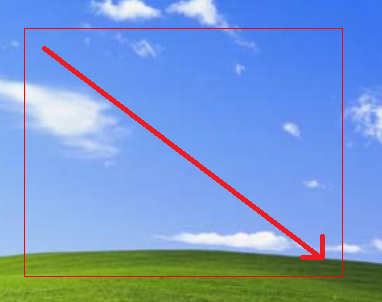
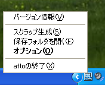

## atto

atto is "Desktop Scrap Tool".

This software allows you to cut out a part of the screen with a single button and display it at top most.
This can be used when you want to refer to a part of another application while working.
It can also be used to take a screenshot of the screen.


### Requirement
- Windows XP Later (x86,x64)
- Visual Studio 2015 C++ Runtime

    ```
    The program can't start because MSVCP140.dll is missing from your computer. Try reinstalling the program to fix this problem.
    ```

- [Download Visual C++ Redistributable for Visual Studio 2015 from Official Microsoft Download Center](https://www.microsoft.com/en-US/download/details.aspx?id=48145)


### Download
- [atto latest download](https://github.com/beckorz/atto/releases/latest)


### Usage

1. Unzip atto.zip
2. Run atto.exe (It will reside in the task tray.)  
   
3. When you want to cut the screen, press <kbd>Ctrl</kbd>+<kbd>1</kbd> key to enter the scrapping state.
   At this time, the mouse cursor will change to indicate that it is ready for scrapping.  
   
    * The default setting for the shortcut keys is <kbd>Ctrl</kbd>+<kbd>1</kbd>.
      If it is being used by other software, it cannot be used.
4. Drag the desired area of the desired part with the 🖱mouse in the Scrapification Preparation state.
   The dragged area will be created as a scrap.  
   
5. Scrapped windows can also be moved around the scrap with the mouse.If the scrap window is in the way, you can reduce or enlarge the scrap window size by double-clicking it. You can also exit the scrap window by using the right-click menu or the <kbd>ESC</kbd> key.
6. If necessary, you can change the settings from the options in the task tray menu.
7. If you want to quit atto, you can do so from the right-click menu in the task tray.  
   

- When uninstalling, the registry is not used, so you can delete it as is.


### Other feature
- Compact size  
    Double-click on the scrap window to instantly switch to a compact size.
    You can cancel it by double-clicking it again.
    Use this when the scrap window is in the way.

- Moving the Scrap Window  
    It can be moved by dragging with the mouse, but can also be moved with the cursor keys.
    In combination with the <kbd>shift</kbd> key, the amount of movement will change.


### Third party software
- [jbeder/yaml-cpp: A YAML parser and emitter in C++](https://github.com/jbeder/yaml-cpp)


### License
This software is free for anyone to use, but we are accepting donations below to continue development.

- [Zenn.dev](https://zenn.dev/beck/books/bd85de79f5c1e1378ba0)
- [Amazon.co.jp gift card to beckorz+atto@gmail.com](https://www.amazon.co.jp/gp/product/B004N3APDM)


### Thanks
- Original author
- うっちー


### Author
beck  
mail: beckorz+atto@gmail.com

